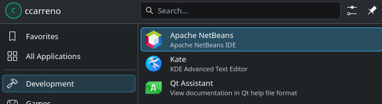

# APACHE NETBEANS LINUX INSTALL

To install Apache NetBeans 31 with Oracle JDK 26, execute the following commands:

```shell
chmod +x install.sh
./install.sh
```

## Configuration (`config.env`)

You can customize the version and download URLs for NetBeans and JDK by editing `config.env`:

- `URL_NETBEANS`: URL to download the Apache NetBeans zip package.
- `URL_JDK`: URL to download the JDK tar.gz package.

To uninstall:

```shell
chmod +x uninstall.sh
./uninstall.sh
```


